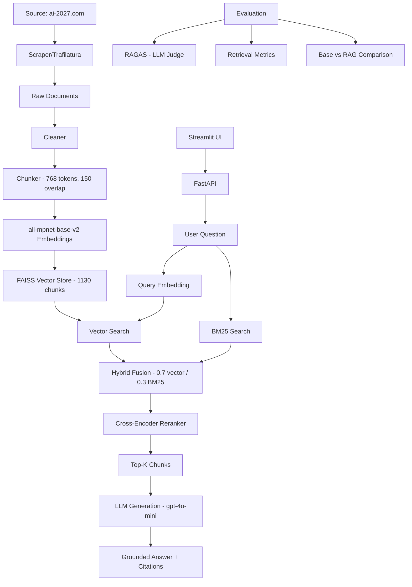

# AI Content RAG

A complete Retrieval-Augmented Generation system that answers questions about AI topics using content from [ai-2027.com](https://ai-2027.com/) as its knowledge base. The system produces grounded answers with citations and evaluates performance using the RAGAS framework.

## Architecture



## Setup

### 1. Clone and install dependencies

```bash
git clone https://github.com/alexandrerays/ai-content-rag.git
cd ai-content-rag
python -m venv venv
source venv/bin/activate  # On Windows: venv\Scripts\activate
pip install -r requirements.txt
```

### 2. Configure environment

```bash
cp .env.example .env
# Edit .env with your API keys and settings
```

Required:
- `OPENAI_API_KEY` — used for LLM generation and RAGAS evaluation

Optional:
- `ANTHROPIC_API_KEY` — alternative LLM provider
- `LLM_PROVIDER` — `openai` (default) or `anthropic`
- `LLM_MODEL` — `gpt-4o-mini` (default)
- `EMBEDDING_MODEL` — `sentence-transformers/all-mpnet-base-v2` (default)
- `RERANKER_MODEL` — `cross-encoder/ms-marco-MiniLM-L-6-v2` (default)
- `DEFAULT_TOP_K` — number of chunks to retrieve (default: 5)
- `CHUNK_SIZE` — tokens per chunk (default: 768)
- `CHUNK_OVERLAP` — overlap tokens between chunks (default: 150)

### 3. Ingest data

```bash
python -m src.ingestion.scraper
```

This scrapes content from ai-2027.com and saves raw documents to `data/raw/`.

### 4. Build the index

```bash
python -m src.indexing.build_index
```

This cleans, chunks, embeds, and indexes all documents into a persistent FAISS vector store.

### 5. Run the API

```bash
uvicorn src.api.main:app --host 0.0.0.0 --port 8000 --reload
```

API docs available at: http://localhost:8000/docs

### 6. Run the UI

```bash
streamlit run src/ui/app.py
```

Opens at: http://localhost:8501

### 7. Run evaluation

See the [Evaluation Metrics](#evaluation-metrics) section for details.

## API Endpoints

| Endpoint | Method | Description |
|----------|--------|-------------|
| `/health` | GET | Health check and index status |
| `/ask` | POST | Ask a question, get RAG answer with citations |
| `/retrieve` | POST | Retrieve relevant chunks without generation |

### Example: POST /ask

```json
{
  "question": "What does the AI 2027 scenario say about AI safety?",
  "top_k": 5
}
```

Response:
```json
{
  "answer": "According to the AI 2027 scenario...",
  "retrieved_contexts": [...],
  "citations": [
    {"title": "...", "source_url": "...", "section": "...", "score": 0.92}
  ],
  "query": "..."
}
```

## Evaluation Metrics

The system is evaluated using three complementary approaches: the RAGAS framework (LLM-judged), retrieval-specific metrics, and a base LLM comparison.

### RAGAS Framework (LLM-as-Judge)

Powered by the [RAGAS](https://github.com/explodinggradients/ragas) library (v0.1.x), which uses an LLM (gpt-3.5-turbo by default) to judge answer quality.

| Metric | Description | Latest Score |
|--------|-------------|:------------:|
| **Faithfulness** | Is every claim in the answer supported by the retrieved context? | 0.86 |
| **Answer Relevancy** | Does the answer directly address the question asked? | 0.57 |
| **Context Precision** | Are the most relevant documents ranked at the top? | 0.78 |
| **Context Recall** | Does the retrieved context cover all aspects of the ground truth? | 0.45 |

> Note: `answer_relevancy` uses RAGAS's question-regeneration approach (generates questions from the answer, then measures embedding similarity to the original). This can produce 0.0 for valid answers that are highly detailed. `context_recall` measures strict attribution of every ground truth sentence to the context.

### Retrieval Metrics

Custom retrieval evaluation using a labeled QA dataset with gold source URLs and context snippets.

| Metric | k=3 | k=5 | k=10 |
|--------|:---:|:---:|:----:|
| **Hit Rate@k** | 0.83 | 0.92 | 1.00 |
| **Recall@k** | 0.75 | 1.00 | 1.00 |

- **Hit Rate@k**: Proportion of queries where the gold source URL appears in the top-k retrieved chunks
- **Recall@k**: Whether key phrases from the gold context snippet are found in the retrieved chunks (using n-gram overlap)

### Base LLM vs RAG Comparison

Generates answers using both the base LLM (no retrieval) and the full RAG pipeline, then compares against expected answers to quantify improvement.

| Approach | Avg Similarity to Expected Answer |
|----------|:---------------------------------:|
| Base LLM (no retrieval) | Lower — relies on training data, may hallucinate |
| RAG (with retrieval) | Higher — grounded in source documents with citations |

### Running Evaluation

```bash
# Full RAGAS evaluation (requires OPENAI_API_KEY for LLM judge)
python -m src.evaluation.evaluate_ragas

# Retrieval metrics only (no LLM calls needed)
python -m src.evaluation.evaluate_retrieval

# Base LLM vs RAG comparison
python -m src.evaluation.compare_base_vs_rag
```

Results are saved to `data/processed/`.

## Tech Stack

| Component | Technology |
|-----------|-----------|
| Embeddings | `sentence-transformers/all-mpnet-base-v2` (768-dim) |
| Reranker | `cross-encoder/ms-marco-MiniLM-L-6-v2` |
| Vector Store | FAISS (IndexFlatIP, cosine similarity) |
| Keyword Search | BM25 (rank-bm25) |
| LLM | OpenAI gpt-4o-mini (configurable) |
| API | FastAPI |
| UI | Streamlit |
| Evaluation | RAGAS framework |

## Project Structure

```
ai-content-rag/
├── src/
│   ├── config.py               # Configuration and environment variables
│   ├── ingestion/
│   │   ├── scraper.py          # Web scraper for ai-2027.com (trafilatura)
│   │   ├── loader.py           # Load raw documents from disk
│   │   ├── cleaner.py          # Text cleaning and preprocessing
│   │   └── chunker.py          # Sentence-aware chunking with metadata
│   ├── indexing/
│   │   ├── embeddings.py       # Embedding generation (sentence-transformers)
│   │   ├── vector_store.py     # FAISS vector store wrapper
│   │   └── build_index.py      # Full indexing pipeline
│   ├── rag/
│   │   ├── retriever.py        # Hybrid retrieval (vector + BM25 + reranking)
│   │   ├── generator.py        # LLM generation (OpenAI/Anthropic)
│   │   ├── pipeline.py         # RAG pipeline orchestration
│   │   └── prompts.py          # Prompt templates with citation instructions
│   ├── evaluation/
│   │   ├── qa_dataset.py       # QA dataset loading
│   │   ├── evaluate_ragas.py   # RAGAS framework evaluation
│   │   ├── evaluate_retrieval.py # Hit rate and recall metrics
│   │   └── compare_base_vs_rag.py # Base LLM vs RAG comparison
│   ├── api/
│   │   └── main.py             # FastAPI application
│   └── ui/
│       └── app.py              # Streamlit interface
├── data/
│   ├── raw/                    # Scraped raw documents (JSON)
│   ├── processed/              # FAISS index and evaluation results
│   └── qa/                     # Labeled QA evaluation dataset (12 examples)
└── tests/
    ├── test_chunking.py        # Chunking unit tests
    ├── test_retrieval.py       # Vector store tests
    └── test_rag_pipeline.py    # Pipeline integration tests
```

## Running Tests

```bash
pytest tests/ -v
```

## Example Questions

1. "What is the main premise of the AI 2027 scenario?"
2. "What role does AI safety play in the narrative?"
3. "How does the scenario describe competition between AI labs?"
4. "What economic impacts of AI are discussed?"
5. "What does the scenario say about AI governance?"

## Known Limitations

- The QA dataset is small (12 examples) and based on content from ai-2027.com
- RAGAS `answer_relevancy` can score 0.0 for valid detailed answers due to its question-regeneration method
- RAGAS evaluation requires an OpenAI API key (used as LLM judge)
- The BM25 component uses simple whitespace tokenization with stopword removal
- The scraper depends on the current structure of ai-2027.com
- Python 3.13+ requires compatibility patches for RAGAS's asyncio executor

## Next Improvements

- Add streaming responses in the API and UI
- Expand the QA dataset with more diverse questions
- Add document update/refresh pipeline
- Implement caching for embeddings and LLM responses
- Add authentication to the API
- Support multiple knowledge base domains
