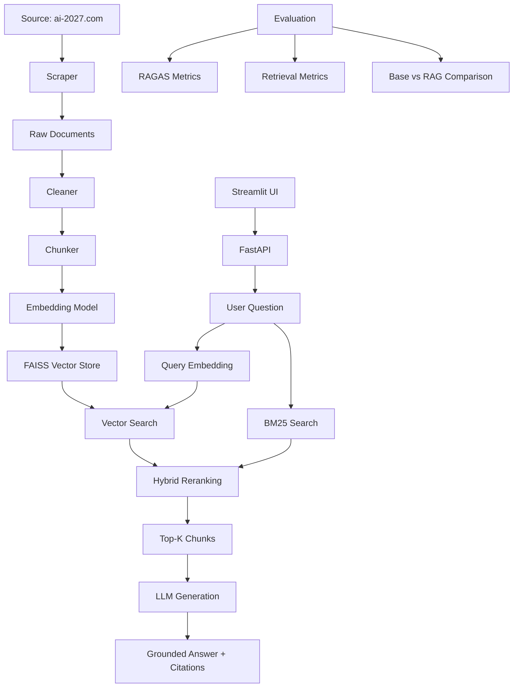

# RAG System - Domain-Specific AI Knowledge Base

A complete Retrieval-Augmented Generation system that answers questions about AI topics using content from [ai-2027.com](https://ai-2027.com/) as its knowledge base. The system produces grounded answers with citations and evaluates performance against a base LLM.

## Architecture



## Setup

### 1. Clone and install dependencies

```bash
cd rag-system
python -m venv venv
source venv/bin/activate  # On Windows: venv\Scripts\activate
pip install -r requirements.txt
```

### 2. Configure API keys

```bash
cp .env.example .env
# Edit .env with your API keys
```

Set at least one LLM provider:
- `OPENAI_API_KEY` for OpenAI (default)
- `ANTHROPIC_API_KEY` for Anthropic

### 3. Ingest data

```bash
python -m src.ingestion.scraper
```

This scrapes content from ai-2027.com and saves raw documents to `data/raw/`.

### 4. Build the index

```bash
python -m src.indexing.build_index
```

This cleans, chunks, embeds, and indexes all documents into a persistent FAISS vector store.

### 5. Run the API

```bash
uvicorn src.api.main:app --host 0.0.0.0 --port 8000 --reload
```

API docs available at: http://localhost:8000/docs

### 6. Run the UI

```bash
streamlit run src/ui/app.py
```

Opens at: http://localhost:8501

### 7. Run evaluation

```bash
# Full RAGAS-style evaluation
python -m src.evaluation.evaluate_ragas

# Retrieval metrics only
python -m src.evaluation.evaluate_retrieval

# Base LLM vs RAG comparison
python -m src.evaluation.compare_base_vs_rag
```

## API Endpoints

| Endpoint | Method | Description |
|----------|--------|-------------|
| `/health` | GET | Health check and index status |
| `/ask` | POST | Ask a question, get RAG answer with citations |
| `/retrieve` | POST | Retrieve relevant chunks without generation |

### Example: POST /ask

```json
{
  "question": "What does the AI 2027 scenario say about AI safety?",
  "top_k": 5
}
```

Response:
```json
{
  "answer": "According to the AI 2027 scenario...",
  "retrieved_contexts": [...],
  "citations": [
    {"title": "...", "source_url": "...", "section": "...", "score": 0.92}
  ],
  "query": "..."
}
```

## Evaluation Metrics

### RAGAS Metrics
- **Faithfulness**: Whether the answer is supported by retrieved context
- **Answer Relevance**: Whether the answer addresses the question
- **Context Precision**: Whether relevant contexts are ranked higher
- **Context Recall**: Whether the gold context is captured in retrieval

### Retrieval Metrics
- **hit_rate@k**: Proportion of queries where the gold source appears in top-k
- **recall@k**: Whether key information from gold context appears in retrieved chunks

### Base vs RAG Comparison
- Generates answers from both base LLM (no retrieval) and RAG system
- Compares against expected answers using word overlap similarity
- Produces a report showing where RAG improves over the base LLM

## Project Structure

```
rag-system/
  src/
    config.py              # Configuration and environment variables
    ingestion/
      scraper.py           # Web scraper for ai-2027.com
      loader.py            # Load raw documents from disk
      cleaner.py           # Text cleaning and preprocessing
      chunker.py           # Document chunking with metadata
    indexing/
      embeddings.py        # Embedding generation (sentence-transformers)
      vector_store.py      # FAISS vector store wrapper
      build_index.py       # Full indexing pipeline
    rag/
      retriever.py         # Hybrid retrieval (vector + BM25)
      generator.py         # LLM generation (OpenAI/Anthropic)
      pipeline.py          # RAG pipeline orchestration
      prompts.py           # Prompt templates
    evaluation/
      qa_dataset.py        # QA dataset loading/saving
      evaluate_ragas.py    # RAGAS-style evaluation
      evaluate_retrieval.py # Retrieval metrics
      compare_base_vs_rag.py # Base vs RAG comparison
    api/
      main.py              # FastAPI application
    ui/
      app.py               # Streamlit interface
  data/
    raw/                   # Scraped raw documents
    processed/             # FAISS index and evaluation results
    qa/                    # QA evaluation dataset
  tests/
    test_chunking.py       # Chunking unit tests
    test_retrieval.py      # Vector store tests
    test_rag_pipeline.py   # Pipeline integration tests
```

## Running Tests

```bash
pytest tests/ -v
```

## Example Questions

1. "What is the main premise of the AI 2027 scenario?"
2. "What role does AI safety play in the narrative?"
3. "How does the scenario describe competition between AI labs?"
4. "What economic impacts of AI are discussed?"
5. "What does the scenario say about AI governance?"

## Known Limitations

- The QA dataset is small (12 examples) and based on expected content from ai-2027.com
- Word-overlap similarity is a simple metric; semantic similarity would be more robust
- The BM25 component uses simple whitespace tokenization
- Evaluation metrics are approximations of the full RAGAS framework
- The scraper depends on the current structure of ai-2027.com

## Next Improvements

- Add semantic similarity scoring using embeddings for evaluation
- Implement cross-encoder reranking for better retrieval precision
- Add streaming responses in the API and UI
- Expand the QA dataset with more diverse questions
- Add document update/refresh pipeline
- Implement caching for embeddings and LLM responses
- Add authentication to the API
- Support multiple knowledge base domains
